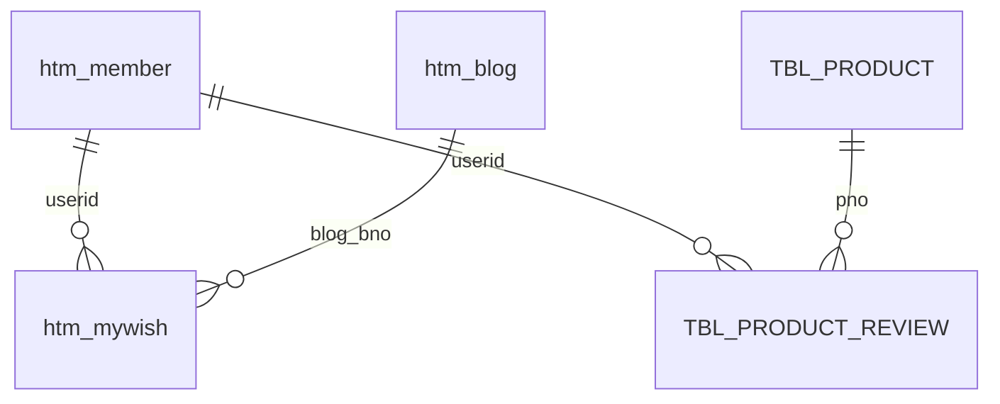

# HOMETRAINING_PROJECT_가이드_v1

# 홈트레이닝 프로젝트 전체 가이드 (비전공자용, 실습 기준)

> 목적: 프로그래밍을 처음 배우는 사람이 `hometraining` 프로젝트를 보고  
> "사용자 클릭 -> 백엔드 처리 -> DB -> 다시 화면" 흐름을 따라갈 수 있게 만든 문서.
>
> 문서 범위:
> - 프로젝트 전체 구조
> - 기능별 흐름(사용자 -> 백엔드 -> 사용자)
> - DB 스키마/관계
> - 실제 코드 위치/URL 매핑

---

## 💡 먼저 알면 좋은 것들

| 말 | 쉽게 이해하기 |
| --- | --- |
| `JSP` | 사용자가 보는 화면 파일 |
| `Controller` | 요청 접수처. 어떤 기능인지 분기한다 |
| `Service` | 실제 처리 담당. 규칙/검증/업무 로직 수행 |
| `DAO` | DB와 직접 대화(SELECT/INSERT/UPDATE/DELETE) |
| `DTO` | 데이터를 담아서 전달하는 상자 |
| `forward` | 서버 내부에서 JSP로 넘김(주소창 안 바뀜) |
| `redirect` | 브라우저에게 새 URL로 이동 지시(주소창 바뀜) |
| `session` | 로그인 상태를 서버가 기억하는 공간 |

---

## 0) 프로젝트 한 줄 요약

운동기구 가격 비교 + 포트폴리오 + 회원/찜/후기 기능이 있는 JSP/Servlet 기반 웹 프로젝트.

---

## 1) 전체 구조 (폴더 기준)

### 백엔드 코드
- `src/main/java/controller` : URL 요청 접수
- `src/main/java/service` : 업무 로직
- `src/main/java/model` : DTO/DAO/Command
- `src/main/java/util` : 공통 유틸(DB, 업로드, 암호화, 리다이렉트)

### 화면 코드
- `src/main/webapp` : JSP 화면
- `src/main/webapp/member` : 회원 관련 화면
- `src/main/webapp/portfolio` : 포트폴리오 화면
- `src/main/webapp/admin` : 관리자 화면

### DB 문서
- `docs/database/HOMETRAINING_SCHEMA.sql` : 실행용 스키마
- `docs/database/SCHEMA_EXPLAIN_FOR_BEGINNER.md` : 스키마 해설

---

## 2) URL 라우팅 맵 (입구 정리)

| URL 패턴 | 담당 Controller | 설명 |
| --- | --- | --- |
| `/main.do` | `MainController` | 메인 페이지 |
| `/mem/*` | `MemberController` | 회원 가입/로그인/마이페이지 |
| `/port/*` | `BlogController` | 포트폴리오 CRUD |
| `/portfolio.do` | `ProductPortfolioController` | 상품 목록 |
| `/port/productWish.do` | `ProductPortfolioController` | 상품 찜 |
| `/review/write.do` | `ProductReviewController` | 후기 작성 |
| `/review/update.do` | `ProductReviewUpdateController` | 후기 수정 |
| `/review/delete.do` | `ProductReviewDeleteController` | 후기 삭제 |
| `/admin/product/*` | `AdminProductController` | 관리자 상품 관리 |

> 시작 페이지: `WEB-INF/web.xml`에서 welcome-file이 `main.do`로 지정됨.

---

## 3) 기능별 흐름 (사용자 -> 백엔드 -> 사용자)

## 3-1. 회원가입/로그인

| 단계 | 주체 | 동작 |
| --- | --- | --- |
| 1 | 사용자 | `join.jsp`, `login.jsp`에서 폼 입력/전송 |
| 2 | 백엔드 | `MemberController`가 `/membersave.do`, `/loginpro.do` 분기 |
| 3 | 백엔드 | `MemberSave`/`MemberLogin`이 검증/처리 |
| 4 | 백엔드 | `MemberDao`가 `htm_member` 조회/저장 |
| 5 | 사용자 | 성공 시 로그인 상태 반영/페이지 이동 |

**위치**
- Controller: `src/main/java/controller/MemberController.java`
- Service: `src/main/java/service/MemberSave.java`, `MemberLogin.java`, `MemberLogout.java`
- DAO: `src/main/java/model/MemberDao.java`
- View: `src/main/webapp/member/join.jsp`, `login.jsp`

---

## 3-2. 포트폴리오(블로그) 목록/상세/작성

| 단계 | 주체 | 동작 |
| --- | --- | --- |
| 1 | 사용자 | `/port/list.do`, `/port/view.do`, `/port/write.do` 접근 |
| 2 | 백엔드 | `BlogController`가 URI별 서비스 호출 |
| 3 | 백엔드 | `BlogSelectAll`/`BlogView`/`BlogWrite`/`BlogUpdate`/`BlogDelete` 실행 |
| 4 | 백엔드 | `BlogDao`가 `htm_blog` 대상 CRUD 수행 |
| 5 | 사용자 | `portfolio/list.jsp`, `view.jsp` 등으로 결과 확인 |

**위치**
- Controller: `src/main/java/controller/BlogController.java`
- Service: `src/main/java/service/Blog*.java`
- DAO: `src/main/java/model/BlogDao.java`
- View: `src/main/webapp/portfolio/*.jsp`

---

## 3-3. 상품 목록/정렬/찜

| 단계 | 주체 | 동작 |
| --- | --- | --- |
| 1 | 사용자 | `/portfolio.do?sub=...&sort=...` 접속, 찜 클릭 |
| 2 | 백엔드 | `ProductPortfolioController`가 목록/찜 분기 |
| 3 | 백엔드 | 목록: `ProductPortfolio`, 찜: `ProductWish` 실행 |
| 4 | 백엔드 | `ProductDao`가 `TBL_PRODUCT`, `TBL_PRODUCT_WISH` 처리 |
| 5 | 사용자 | `portfolio.jsp`에서 목록/찜 결과 확인 |

**위치**
- Controller: `src/main/java/controller/ProductPortfolioController.java`
- Service: `src/main/java/service/ProductPortfolio.java`, `ProductWish.java`
- DAO: `src/main/java/model/ProductDao.java`
- View: `src/main/webapp/portfolio.jsp`

---

## 3-4. 상품 후기 작성/수정/삭제

| 단계 | 주체 | 동작 |
| --- | --- | --- |
| 1 | 사용자 | 리뷰 폼 제출 (`/review/write.do`, `/review/update.do`, `/review/delete.do`) |
| 2 | 백엔드 | 각 리뷰 전용 Controller가 요청 수신 |
| 3 | 백엔드 | `ProductReviewWrite/Update/Delete` 실행 |
| 4 | 백엔드 | `ProductReviewDao`가 후기 CRUD + 제품 후기수 갱신 |
| 5 | 사용자 | 리뷰 리스트/평점 상태 확인 |

**위치**
- Controller: `src/main/java/controller/ProductReview*Controller.java`
- Service: `src/main/java/service/ProductReview*.java`
- DAO: `src/main/java/model/ProductReviewDao.java`
- View: `src/main/webapp/review_detail.jsp`

---

## 3-5. 마이페이지/찜 목록/프로필 수정

| 단계 | 주체 | 동작 |
| --- | --- | --- |
| 1 | 사용자 | `/mem/mypageMain.do`, `/mem/mypage.do`, `/mem/profileEdit.do` 접근 |
| 2 | 백엔드 | `MemberController`가 마이페이지 기능 분기 |
| 3 | 백엔드 | `MypageMain`, `MyWishList`, `ProfileEdit`, `ProfileUpdate` 수행 |
| 4 | 백엔드 | `MemberDao`, `BlogDao`, `ProductDao`에서 필요한 데이터 조회/수정 |
| 5 | 사용자 | `mypage.jsp`, `wishlist.jsp`, `profileEdit.jsp`에서 반영 결과 확인 |

---

## 3-6. 관리자 상품 추가/수정/삭제

| 단계 | 주체 | 동작 |
| --- | --- | --- |
| 1 | 사용자(관리자) | `/admin/product/add.do`, `/edit.do` 접근 |
| 2 | 백엔드 | `AdminProductController`가 세션의 `userid`가 `admin`인지 검사 |
| 3 | 백엔드 | `ProductAdd`, `ProductEdit`, `ProductUpdate`, `ProductDelete` 실행 |
| 4 | 백엔드 | `ProductDao`가 `TBL_PRODUCT` CRUD |
| 5 | 사용자 | `admin/product_form.jsp` 및 목록 화면에서 결과 확인 |

---

## 4) DB 스키마 핵심 요약

### 핵심 테이블
- `htm_member` : 회원
- `htm_blog` : 포트폴리오 글
- `htm_mywish` : 포트폴리오 찜
- `TBL_PRODUCT` : 상품
- `TBL_PRODUCT_REVIEW` : 후기
- `TBL_PRODUCT_WISH` : 상품 찜(코드 사용 테이블)

### 시퀀스
- `htm_blog_seq`
- `htm_mywish_seq`
- `SEQ_PRODUCT`
- `SEQ_PRODUCT_REVIEW`
- `SEQ_PRODUCT_WISH` (코드에서 사용)

### 스키마 파일 위치
- 실행 SQL: `docs/database/HOMETRAINING_SCHEMA.sql`
- 설명서: `docs/database/SCHEMA_EXPLAIN_FOR_BEGINNER.md`

---

## 5) DB 관계 그림 (초보자용)

---

## 6) 백엔드 전체 파일 인덱스

### Controller
- `src/main/java/controller/AdminProductController.java`
- `src/main/java/controller/BlogController.java`
- `src/main/java/controller/MainController.java`
- `src/main/java/controller/MemberController.java`
- `src/main/java/controller/ProductPortfolioController.java`
- `src/main/java/controller/ProductReviewController.java`
- `src/main/java/controller/ProductReviewDeleteController.java`
- `src/main/java/controller/ProductReviewUpdateController.java`
- `src/main/java/controller/ProductReviewViewController.java`

### Service
- `src/main/java/service/BlogDelete.java`
- `src/main/java/service/BlogSelectAll.java`
- `src/main/java/service/BlogSelectIndex.java`
- `src/main/java/service/BlogUpdate.java`
- `src/main/java/service/BlogView.java`
- `src/main/java/service/BlogWrite.java`
- `src/main/java/service/GoogleLogin.java`
- `src/main/java/service/MemberLogin.java`
- `src/main/java/service/MemberLogout.java`
- `src/main/java/service/MemberSave.java`
- `src/main/java/service/MyDelete.java`
- `src/main/java/service/MyDeleteSelected.java`
- `src/main/java/service/MypageMain.java`
- `src/main/java/service/MyWishList.java`
- `src/main/java/service/ProductAdd.java`
- `src/main/java/service/ProductDelete.java`
- `src/main/java/service/ProductEdit.java`
- `src/main/java/service/ProductPortfolio.java`
- `src/main/java/service/ProductReviewDelete.java`
- `src/main/java/service/ProductReviewUpdate.java`
- `src/main/java/service/ProductReviewView.java`
- `src/main/java/service/ProductReviewWrite.java`
- `src/main/java/service/ProductUpdate.java`
- `src/main/java/service/ProductWish.java`
- `src/main/java/service/ProfileEdit.java`
- `src/main/java/service/ProfileUpdate.java`
- `src/main/java/service/ReviewCarousel.java`
- `src/main/java/service/UseridCheck.java`
- `src/main/java/service/mywish.java`

### Model / Util
- `src/main/java/model/*.java`
- `src/main/java/util/*.java`

---

## 7) JSP 전체 파일 인덱스

- `src/main/webapp/admin/product_form.jsp`
- `src/main/webapp/category.jsp`
- `src/main/webapp/detail.jsp`
- `src/main/webapp/footer.jsp`
- `src/main/webapp/header.jsp`
- `src/main/webapp/index.jsp`
- `src/main/webapp/member/join.jsp`
- `src/main/webapp/member/login.jsp`
- `src/main/webapp/member/mypage.jsp`
- `src/main/webapp/member/profileEdit.jsp`
- `src/main/webapp/member/wishlist.jsp`
- `src/main/webapp/portfolio.jsp`
- `src/main/webapp/portfolio/list.jsp`
- `src/main/webapp/portfolio/update.jsp`
- `src/main/webapp/portfolio/view.jsp`
- `src/main/webapp/portfolio/write.jsp`
- `src/main/webapp/product.jsp`
- `src/main/webapp/review_detail.jsp`

---

## 8) 처음 공부할 때 추천 순서

1. `index.jsp` -> `MainController`
2. `member/login.jsp` -> `MemberController` -> `MemberLogin`
3. `portfolio/list.jsp` -> `BlogController` -> `BlogSelectAll` -> `BlogDao`
4. `portfolio.jsp` -> `ProductPortfolioController` -> `ProductPortfolio` -> `ProductDao`
5. `review_detail.jsp` -> 리뷰 컨트롤러/서비스/DAO
6. 마지막에 `docs/database/HOMETRAINING_SCHEMA.sql` 보기

---

## 9) 빠른 실행 체크리스트

- [ ] DB에 `HOMETRAINING_SCHEMA.sql` 실행
- [ ] `main.do` 접속 확인
- [ ] 회원가입/로그인 테스트
- [ ] 포트폴리오 목록/상세 테스트
- [ ] 상품 목록/찜/후기 테스트
- [ ] 마이페이지(찜/프로필수정) 테스트

