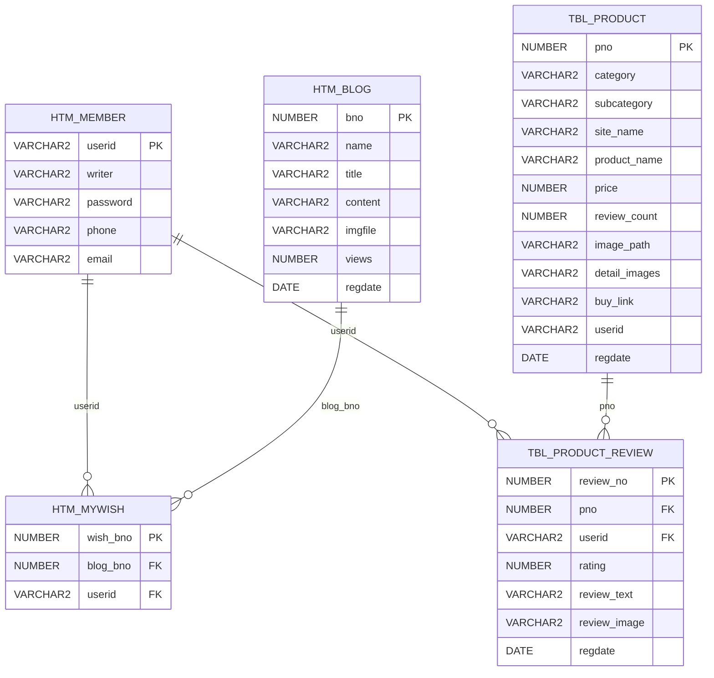

# HOMETRAINING DB 스키마 설명서 (비전공자용)

이 문서는 `HOMETRAINING_SCHEMA.sql`이 만드는 데이터베이스 구조를 쉽게 설명합니다.

---

## 1) 스키마 파일이 하는 일

`HOMETRAINING_SCHEMA.sql`은 아래를 한 번에 만듭니다.

- 테이블: 데이터를 저장하는 칸
- 시퀀스: 번호 자동 증가 장치
- 인덱스: 검색 속도 향상 장치
- 제약조건: 잘못된 데이터가 못 들어오게 하는 안전장치

---

## 2) 테이블 관계 그림 (ER 개념도)

---

## 3) 테이블별 쉬운 설명

### `htm_member` (회원)
- 회원 기본 정보 저장
- `userid`가 회원의 고유 키(PK)

### `htm_blog` (포트폴리오 글)
- 포트폴리오/블로그 글 저장
- `bno`가 글 번호(PK)

### `htm_mywish` (포트폴리오 찜)
- 어떤 회원이 어떤 글을 찜했는지 저장
- `(blog_bno, userid)`에 유니크가 있어 같은 글을 같은 사람이 중복 찜 못함
- 글 또는 회원이 삭제되면 찜도 같이 삭제됨 (`ON DELETE CASCADE`)

### `TBL_PRODUCT` (제품)
- 제품 정보 저장
- `pno`가 제품 번호(PK)
- 카테고리, 가격, 이미지, 구매 링크 등 저장

### `TBL_PRODUCT_REVIEW` (제품 후기)
- 회원이 제품에 남긴 후기
- 별점(`rating`)은 1~5만 허용
- `(pno, userid)` 유니크로 같은 제품에 같은 사용자가 후기 1개만 작성 가능
- 회원 또는 제품이 삭제되면 관련 후기도 같이 삭제됨

---

## 4) 시퀀스(자동 번호) 설명

- `htm_blog_seq`: 블로그 글 번호 생성
- `htm_mywish_seq`: 찜 번호 생성
- `SEQ_PRODUCT`: 제품 번호 생성
- `SEQ_PRODUCT_REVIEW`: 후기 번호 생성

쉽게 말해, 새 데이터 넣을 때 "다음 번호"를 자동으로 줍니다.

---

## 5) 인덱스 설명

인덱스는 "DB 책갈피"라고 생각하면 됩니다.

- `IDX_PRODUCT_USERID`, `IDX_PRODUCT_SUBCATEGORY`, `IDX_PRODUCT_CATEGORY`
- `IDX_REVIEW_PNO`, `IDX_REVIEW_USERID`, `IDX_REVIEW_RATING`

조회가 많은 컬럼에 붙여서 검색을 빠르게 합니다.

---

## 6) 안전장치(제약조건) 설명

- `PRIMARY KEY`: 같은 키 중복 금지 + 비어있으면 안 됨
- `FOREIGN KEY`: 부모 테이블에 없는 값은 자식 테이블에 못 넣음
- `UNIQUE`: 중복 금지
- `CHECK`: 값 범위 제한 (별점 1~5)

---

## 7) 실행 방법 (Oracle 기준)

1. SQL 툴(SQL Developer 등)에서 DB 연결
2. `docs/database/HOMETRAINING_SCHEMA.sql` 열기
3. 전체 실행
4. 생성 확인:
   - `SELECT * FROM htm_member;`
   - `SELECT * FROM htm_blog;`
   - `SELECT * FROM TBL_PRODUCT;`
   - `SELECT * FROM TBL_PRODUCT_REVIEW;`

---

## 8) 주의사항

- 이미 같은 이름의 테이블/시퀀스가 있으면 생성 오류가 날 수 있습니다.
- 운영 DB에서는 먼저 백업 후 실행하세요.
- 문서 끝의 DROP 예시는 필요할 때만 직접 주석 해제해서 사용하세요.

